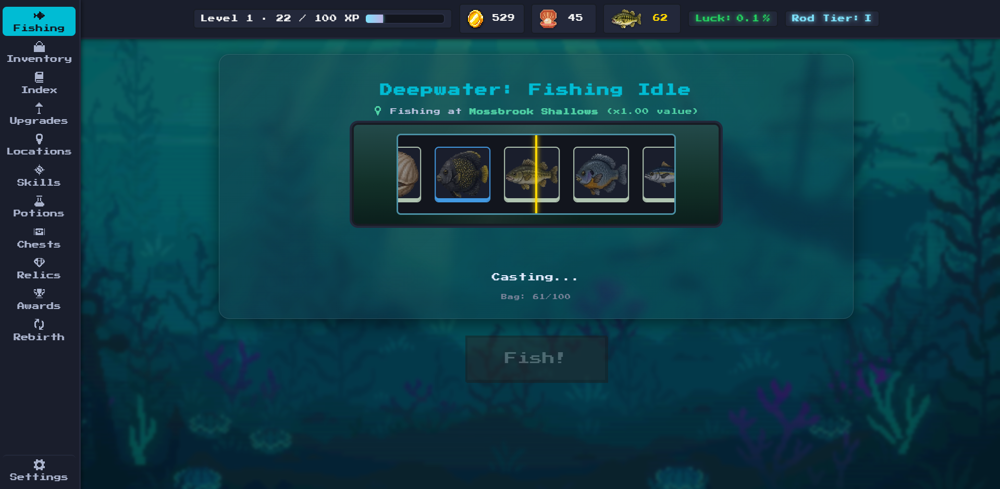

<div align="center">



<h1>Deepwater: Fishing Idle</h1>

<p><strong>A pixel-art idle fishing game about catching fish, building your collection, and seeing how deep you can go.</strong></p>

<p>
  <a href="https://github.com/edwinyaboy/Deepwater-Fishing-Idle/releases/latest">Download</a> ·
  <a href="#get-started">Get started</a> ·
  <a href="#features">Features</a> ·
  <a href="#releases">Releases</a> ·
  <a href="#license">License</a>
</p>

</div>

<p align="center">
  
</p>

## Fish. Upgrade. Repeat.

Deepwater combines the progression of an idle game with a hands-on fishing loop. Every cast gives you another chance at a better catch, while upgrades gradually push your fishing setup further.

## Features

| Fishing                 | Progression        | Collection           |
| :---------------------- | :----------------- | :------------------- |
| Fast reel-based fishing | Fishing upgrades   | Fish index           |
| Auto Fish               | Skill tree         | Rare catches         |
| Triple Hook             | Rebirths           | Achievements         |
| Rare catch effects      | Mastery            | Catch statistics     |
| Offline progression     | Potions and boosts | Long-term collection |

### Fishing

* Fast visual reel and catch system
* Chance-based fish rolls
* Dynamic fishing speed upgrades
* Triple Hook multi-catch fishing
* Auto Fish for hands-off progression
* Rare catch effects and sounds

### Progression

* Fishing speed, luck and storage upgrades
* Skill tree
* Rebirths
* Mastery progression
* Potions and temporary boosts
* Treasure chests
* Pearls and other progression currencies

### Collection

* Fish index and discovery tracking
* Rare fish and valuable catches
* Catch statistics
* Achievements and milestones
* Long-term collection progression

### Offline Progression

Leave the game running in the background and come back to your catches later.

Deepwater tracks offline time and calculates your missed fishing progress when you return, with a defined offline cap.

## Get started

Deepwater runs directly in a modern web browser.

Download the latest release from [Releases](../../releases/latest), or use the browser source package for a local copy.

### Run from source

Clone the repository and open `index.html` in a modern browser.

```text
Deepwater-Fishing-Idle/
├── index.html
├── js/
├── css/
└── assets/
```

There is no frontend framework or build step required for the browser version.

## Android

Deepwater is also available as a native Android build packaged with Capacitor.

Download the latest APK from [Releases](../../releases/latest).

## Releases

| Platform | Download       |
| :------- | :------------- |
| Browser  | Source package |
| Android  | APK            |

The latest builds and source packages are available on the [Releases](../../releases) page.

## Save Data

Player progression is stored locally in the browser.

Save data includes:

* Coins and Pearls
* Fishing upgrades
* Skills
* Inventory
* Fish discoveries
* Achievements
* Potions
* Chests
* Relics
* Mastery
* Rebirth progression

Save data is versioned so existing saves can be migrated when the game changes.

## Technology

Deepwater is built with a deliberately lightweight web stack.

| Technology    | Use                            |
| :------------ | :----------------------------- |
| HTML          | Game interface                 |
| CSS           | Layout and visual presentation |
| JavaScript    | Game systems and progression   |
| Local Storage | Persistent player saves        |
| Capacitor     | Android packaging              |

The browser version does not require a framework, bundler, or external backend.

## Development

The public repository contains the playable game source.

Development tools, test infrastructure, Android build configuration, release signing material, and other internal development files are kept outside the public game source.

## Credits

Created and developed as **Deepwater: Fishing Idle**.

Third-party assets, libraries, fonts, and other components remain subject to their respective licenses and terms.

## License

**Copyright 2026 Deepwater Fishing Idle. All rights reserved.**

This repository is publicly available for inspection.

No license is granted to copy, modify, redistribute, sublicense, sell, publish, repackage, or create derivative versions of Deepwater: Fishing Idle, its source code, or its included assets without prior written permission from the copyright holder.

This includes, but is not limited to:

* Releasing the game as your own
* Republishing the game or modified versions
* Distributing the source code elsewhere
* Selling or commercially distributing the project
* Uploading the project to another store or distribution platform
* Creating and publishing derivative games using the project
* Removing or altering copyright notices

Public availability of this repository does not grant permission to reuse or redistribute the project.

Third-party assets and libraries remain subject to their respective licenses and terms.

For licensing, collaboration, or other permissions, contact the copyright holder.

<div align="center">

**Deepwater: Fishing Idle**

*Cast deeper. Catch rarer. Keep fishing.*

</div>